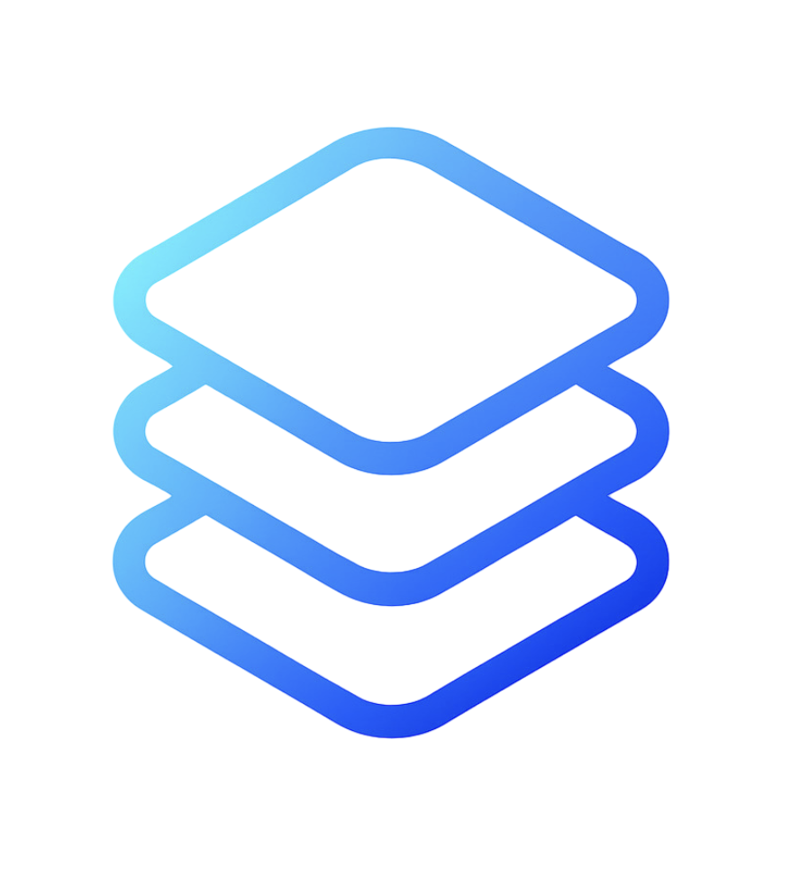

# 🚀 Welcome to Launch Layer Docs

Launch Layer is your open-source, community-powered launchpad for the Sonic network. We believe in making token launches accessible, transparent, and fair for everyone—no gatekeeping, no platform tokens, and no unnecessary complexity.

Whether you're a builder or a participant, Launch Layer gives you the tools to create, join, and grow new projects with confidence.

<!-- Optional: Consider embedding a short (1-2 minute) introductory video here if available. -->
<!-- Example for video embed: <iframe width="560" height="315" src="YOUR_VIDEO_EMBED_URL" frameborder="0" allowfullscreen></iframe> -->

---

## Our Mission

Our mission is to empower the next wave of DeFi innovation by providing neutral, permissionless infrastructure for clean, fixed-price token launches. Everything is on-chain, non-custodial, and designed for simplicity.

## ✨ Explore Our Documentation

This documentation provides everything you need to understand and utilize Launch Layer effectively. Explore the key areas below (these can be styled as Cards in GitBook for a more visual navigation):

*   **[🚀 Launch Your Token](fixed-price-mode.md)**
    *   *Discover how to use Launch Layer for a straightforward, fixed-price token sale. Learn about the process, benefits, and step-by-step guides for projects and participants.*
*   **[🎁 Understanding Airdrops](airdrop-recipes.md)**
    *   *Explore best practices for airdrops on the Sonic network, focusing on fairness, transparency, and community engagement.*
*   **[🧰 Resources](resources.md)**
    *   *Find essential links, guides on bridging to Sonic, developer information, and tips for staying safe in the Web3 space.*
*   **[📜 Legal & Information](informational.md)**
    *   *Review our Terms of Service, Privacy Policy, and important Risk Disclosures before using Launch Layer.*

---

Ready to launch or join the next big thing? Dive in using the links above or the sidebar navigation! 